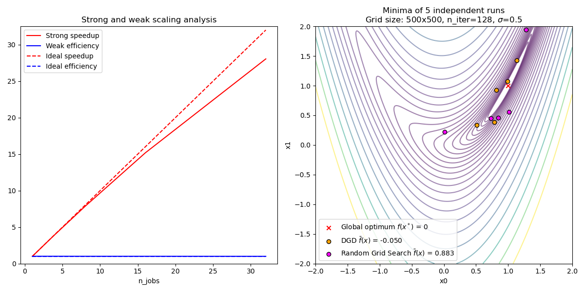

# **Distributed Grid Descent**

An implementation of *Distributed Grid Descent*: **an algorithm for hyperparameter tuning guided by Bayesian inference, designed to run on multiple processes and potentially many machines with no central point of control** as described in Appendix B of *Working Memory Graphs* [[Loynd et al., 2019](https://arxiv.org/abs/1911.07141)].

**Note:** This project is a work in progress. Please contact me if you like to contribute and help to develop a fully fledged python library out of it.

## Usage

```python
import numpy as np
from dgd import DistributedGridDescent

model = ... # model wrapper
data = {
    "train_data": ...
}

param_grid = {
    "learning_rate":[3e-3, 1e-3, 3e-4, 1e-4, 3e-5, 1e-5],
    "optimizer":["adam", "rmsprop"],
    "lr_annealing":[False, 0.95, 0.99],
    "batch_size":[32, 64, 128, 256, 1024],
    "num_linear_layers":[1, 2, 4, 8, 16],
    "num_neurons":[512, 256, 128, 64, 32, 16],
    "dropout":[0.0, 0.1, 0.3, 0.5],
    "l2":[0.0, 0.01, 0.1]
}

dgd = DistributedGridDescent(model, param_grid, metric=np.mean, n_jobs=-1)
dgd.run(data)

print(dgd.best_params_)
df = pd.DataFrame(dgd.results_).set_index("ID").sort_values(by=["metric"],ascending=False)
```

## Examples and Tutorials

See `sklearn_example.py`, `pytorch_example.py`, `rosenbrock_example.py` and `tensorflow_example.py` in the examples folder for examples of basic usage of `dgd`.  
See `rosenbrock_server_example.py` for an example of distributed usage.

## Strong and weak scaling analysis



## Algorithm

```
Input: Set of hyperparameters H, each having a discrete, ordered set of possible values.  
Input: Maximum number of training steps N per run.  
repeat  
    Download any new results.  
    if no results so far then
        Choose a random configuration C from the grid defined by H.
    else
        Identify the run set S with the highest metric.
        Initialize neighborhood B to contain only S.
        Expand B by adding all possible sets whose configurations differ from that of S by one step in exactly one hyperparameter setting.
        Calculate a ceiling M = Count(B) + 1.
        Weight each run set x in B M - Count(x).
        Sample a random run set S' from B according to run set weights.
        Choose configuration C from S'.
    end if
    Perform one training run of N steps using C.
    Calculate the runs Metric.
    Log the result on shared storage.
until terminated by user.

```

See Appendix B of [Loynd et al., 2019](https://arxiv.org/abs/1911.07141) for details.
